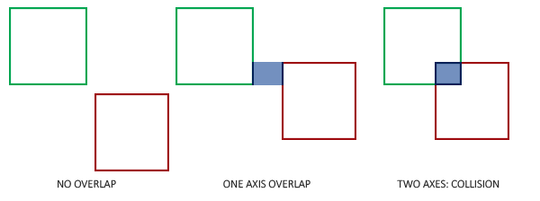

### Goals
* Learn the basics drawing using the canvas api
* Creating an animation loop
* Collision detection
* Object Oriented Inheritance

## Introduction to Game Time Starter Kit

### Project Organization

##### index.js
DOM interaction
Event Listeners

##### Game.js
Game setup
Game status
What to do when objects collide
Tracking score...
Event handling

##### GamePiece.js
Draw
Movement
Collision detection

##### Block.js
Specialized functions

## Canvas API

#### Canvas Coordinate System

The canvas is a grid of pixels. When we use the canvas to draw 2d pictures, each pixel has a x and a y location that determines where it is on the canvas. In the image below four pixels are shaded gray and their addresses are listed with the x-coordinate first followed by the y-coordinate.


#### Canvas Context
The canvas context is the API which we will use to interact with the canvas.

```js
const canvas = document.querySelector('#game');
const ctx = canvas.getContext('2d');
```

#### .fillRect(x, y, width, height)
We can use the context `fillRect` method to draw solid rectangles on our canvas. It takes four arguments, 

* **x**: the starting position on the horizontal axis for the rectangle
* **y**: the starting position on the vertical axis for the rectangle
* **width**: the width in pixels of the rectangle 
* **height**: the height in pixels of the rectangle

```js
ctx.fillRect(x, y, width, height);
```

#### .fillStyle
The context fillStyle property is used to change the color of the filled rectangle we draw.

```js
ctx.fillStyle = 'green';
```

#### .clearRect(x, y, width, height)
The context clearRect method is used to clear our canvas between animation frames. It takes the same arguments as fillRect.

```js
ctx.clearRect(x, y, width, height);
```

## Animation Loop

#### requestAnimationFrame(callback)
#### speed

## Collision Detection




[Great Blog Post on Collision Detection](https://learnopengl.com/In-Practice/2D-Game/Collisions/Collision-detection)

#### Collision Between Rectangles
#### Collision With Boundaries

## Object Oriented Programming - Inheritance

#### Inheritance
With Object Oriented Programming we organize our code by creating classes. These classes are templates for different objects which we will use in our application. 

Inheritance is when a child class inherits properties and methods from a parent class. When we create a child method we can tell it to inherit from another class using the `extends` and `super` keywords.

#### extends
The `extends` keyword allows to tell a class that it will inherit from another class. In our example below, Block will inherit all the properties and methods of GamePiece. The Block class can add additional properties and methods to all blocks.

```js
class Block extends GamePiece {
}
```

#### super
The super keyword is used to invoke parent class methods. When it is used directly in the child constructor function, it invokes the parent class constructor function.

```js
class Block extends GamePiece {
    constructor(x, y, width, height) {
        // invoke GamePiece constructor method
        super(x, y, width, height);
    }
}
```

It can also be used in other methods to invoke parent class methods.

```js
class Block extends GamePiece {
    constructor(x, y, height, width, color, borderColor) {
        // invoke parent class constructor
        super(x, y, height, width, color);

        this.borderColor = borderColor;
    } 

    draw(ctx) {
        const {x, y, height, width, borderColor } = this;

        // invoke GamePiece draw method
        super.draw(ctx);

        // draw block border
        ctx.strokeStyle = borderColor;
        ctx.strokeRect(x, y, width, height);
    }
}
```


