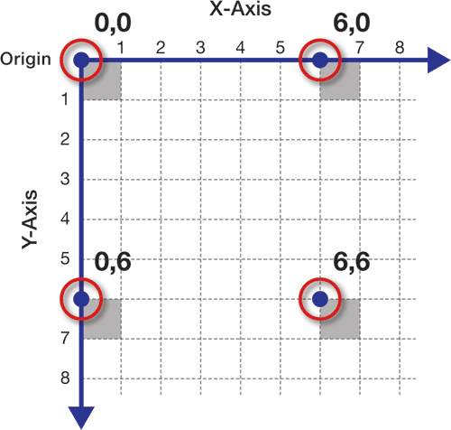
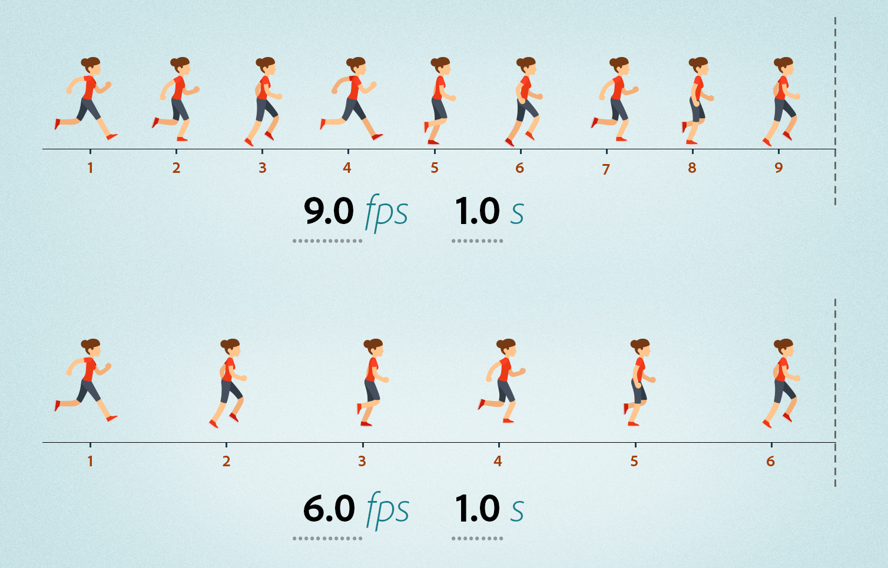

### Goals
* Learn the basics drawing using the canvas api
* Creating an animation loop
* Collision detection
* Object Oriented Inheritance

## Introduction to Game Time Starter Kit

### Project Organization

##### index.js
* DOM interaction
* Event Listeners

##### Game.js
* Game setup
* Game status
* What to do when objects collide
* Tracking score
* Event handling

##### GamePiece.js
* Draw
* Movement
* Collision detection

##### Block.js
* Block specific properties and methods

## Canvas API

#### Canvas Coordinate System

The canvas is a grid of pixels. When we use the canvas to draw 2d pictures, each pixel has a x and a y location that describes where it is on the canvas. In the image below four pixels are shaded gray and their addresses are listed with the x-coordinate first followed by the y-coordinate.

<!-- draw (x, y) on the board -->



#### Canvas Context
The canvas context is the API which we will use to interact with the canvas. [2d Rendering Context Documentation](https://developer.mozilla.org/en-US/docs/Web/API/CanvasRenderingContext2D)

<!--
Take a moment to explore the 2d context documentation
-->

```js
const canvas = document.querySelector('#game');
const ctx = canvas.getContext('2d');
```

#### .fillRect(x, y, width, height)
The `fillRect` method to draw solid rectangles on our canvas. It takes four arguments, 

* **x**: the starting position on the horizontal axis for the rectangle
* **y**: the starting position on the vertical axis for the rectangle
* **width**: the width in pixels of the rectangle 
* **height**: the height in pixels of the rectangle

```js
ctx.fillRect(x, y, width, height);
```


<!-- 
draw coordinates on the board for each point in the picture 
(x, y) -> (3, 3)
(x + width, y) -> (3 + 4, 3)
(x, y + height) -> (3, 3 + 4)
(x + width, y + height) -> (3 + 4, 3 + 4)
-->

#### .fillStyle
The fillStyle property is used to change the color of the filled rectangle we draw using the fillRect method.

```js
ctx.fillStyle = 'green';
```

#### .clearRect(x, y, width, height)
The context clearRect method is used to clear our canvas between animation frames. It takes the same arguments as fillRect. If we want to clear our entire canvase we will want to start at the top left corner of our canvas (x: 0, y: 0) and go to the bottom right corner of our canvas (x: canvasWidth, y: canvasHeight).

```js
// ctx.clearRect(x, y, width, height);
ctx.clearRect(0, 0, canvasWidth, canvasHeight);
```

## Animation
So far we have learned how to draw one a picture on our canvas. This picture is called a frame. To create an animation we need to draw many frames one after another. 



To create the illusion that all of these frames are connected and represent a moving image we need to create a lot of images and show them one after the other very rapidly. To achieve a believable animation, we need to draw 60 frames per second on our canvas. Modern browsers are constantly updating and repainting the screen we see. Luckily for us, there is a built in method that we can use to run some code when the browser repaints itself which is 60 times per second. 

#### requestAnimationFrame(callback)
requestAnimationFrame takes a callback function as an argument. The callback function will run when the browser repaints itself. If you want to create an animation, the callback function will need to call requestAnimationFrame again to paint the next frame.

```js
// start animation loop
window.requestAnimationFrame(gameLoop);

function gameLoop () {
    // clear previous frame
    ctx.clearRect(0, 0, canvas.width, canvas.height);
    
    // draw this frame
    game.animate();

    // draw next frame
    window.requestAnimationFrame(gameLoop)
}
```

#### speed

## Collision Detection

[Great MDN Article on Collision Detection](https://developer.mozilla.org/en-US/docs/Games/Techniques/2D_collision_detection)

#### Collision Between Rectangles
An easy way to determine if two rectangles are colliding is with the Axis-Aligned Bounding Box. We can check if there is no gap between any of the sides of the two rectangles than they must be colliding.

If all of following are true than our first rectangle (r1) is colliding with our second rectangle (r2).

* r1.x < r2.x + r2.width
* r1.x + r1.width > r2.x
* r1.y < r2.y + r2.height
* r1.y + r1.height > r2.y

Our GamePiece class has an isCollidingWith method that takes an object as an argument. This method determines if the object parameter is colliding with this particular GamePiece. In our code, `this` represents rectangle1 and the object parameter represents rectangle2.

```js
isCollidingWith(object) {
    return (
        this.x < object.x + object.width && 
        this.x + this.width > object.x &&
        this.y < object.y + object.height &&
        this.y + this.height > object.y
    );
  }
```

<!--
Create two objects and demonstrate that the collision detection works.

// Game constructor
this.blocks = [
  new Block(50, 50, 10, 10, 'red', 'black'),
  new Block(59, 59, 10, 10, 'green', 'black')
];

// Game animate
const { blocks } = this;
const collision = blocks[0].isCollidingWith(blocks[1]);

console.log(collision)
-->


#### Collision With Canvas Boundaries

To determine if our block is inside our canvas, we need to check if any of our rectangle sides are outside our canvas.


If any of the following four statements are true than our rectangle is inside of our canvas.

* x < 0
* x + width > canvas.width
* y < 0
* y + height > canvas.height

```js
isCollidingWithWall(canvasWidth, canvasHeight) {
    return (
        this.x < 0 ||
        this.x + this.width > canvasWidth ||
        this.y < 0 || 
        this.y + this.height > canvasHeight
    )
}
```

#### Exercise
* When a block hits the border, do not end the game, instead reverse the blocks direction.

## Object Oriented Programming - Inheritance

#### Inheritance
With Object Oriented Programming we organize our code by creating classes. These classes are templates for different objects which we will use in our application. 

Inheritance is when a child class inherits properties and methods from a parent class. When we create a child method we can tell it to inherit from another class using the `extends` and `super` keywords.

#### extends
The `extends` keyword allows to tell a class that it will inherit from another class. In our example below, Block will inherit all the properties and methods of GamePiece. The Block class can add additional properties and methods to all blocks.

```js
class Block extends GamePiece {
}
```

#### super
The super keyword is used to invoke parent class methods. When it is used directly in the child constructor function, it invokes the parent class constructor function.

```js
class Block extends GamePiece {
    constructor(x, y, width, height) {
        // invoke GamePiece constructor method
        super(x, y, width, height);
    }
}
```
<!--
Place a debugger before the super invokation. Then walk through dev tools and show how the super invokes the parent constructor method.
-->


It can also be used in other methods to invoke parent class methods.

```js
class Block extends GamePiece {
    constructor(x, y, height, width, color, borderColor) {
        // invoke parent class constructor
        super(x, y, height, width, color);

        this.borderColor = borderColor;
    } 

    draw(ctx) {
        const {x, y, height, width, borderColor } = this;

        // invoke GamePiece draw method
        super.draw(ctx);

        // draw block border
        ctx.strokeStyle = borderColor;
        ctx.strokeRect(x, y, width, height);
    }
}
```

<!--
Comment out `super.draw(ctx)` to show the difference in hw the block(s) render
-->

## Event Handling
Our event listeners go in our index.js file. Once an event fires, the event listener can notify the game that an event occured, then the game can determine how it should handle that event. This ensures seperation of concerns, index is only concerned with detecting events, and the game file is only concerned with doing something when an event occurs. This also makes writing tests easier.

```js
// Add key press event handler
document.addEventListener('keydown', handleKeyPress);

function handleKeyPress(event) {
  game.handleKeyPress(event);
}
```
#### Exercise 1
* Pause the game when the letter p is pressed
* When the game is paused no animations should happen

#### Exercise 2
* Add a mouse event listener and event handler
* When the mouse is clicked create a new block and add it to the game's blocks array

## Closing
There are a lot of moving pieces when creating a game. This gametime starter kit aims to provide some structure and guidance as you create your game so you can focus on creating objects that interact with each other.